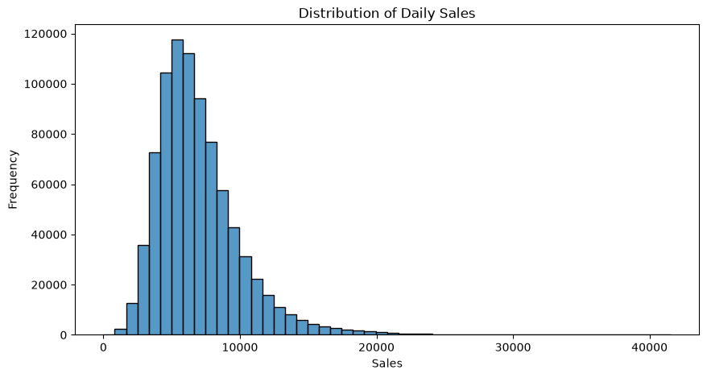
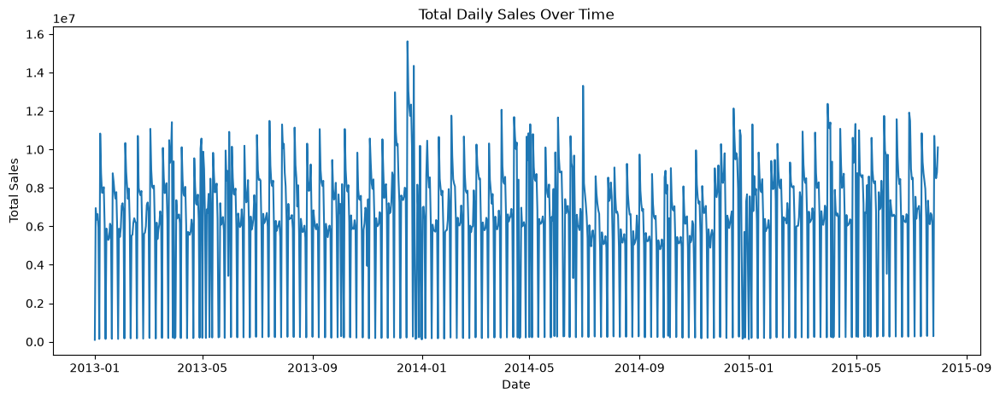
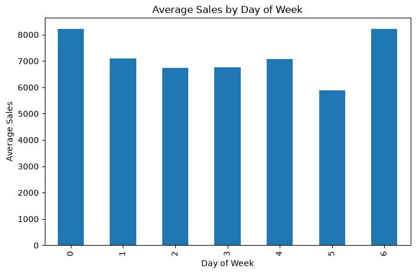
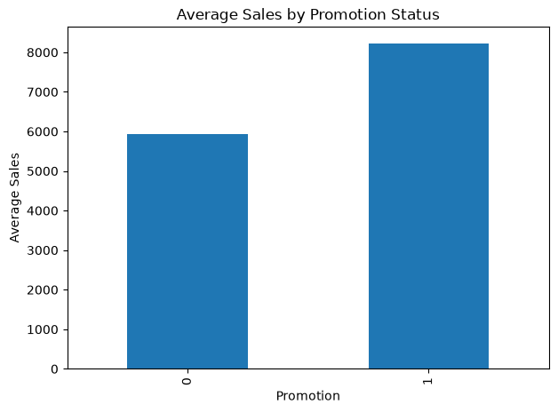
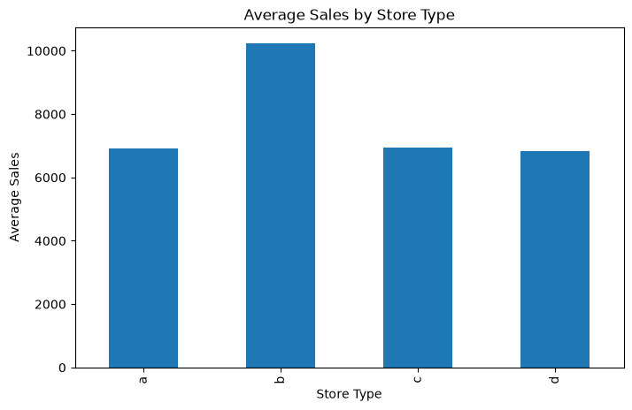
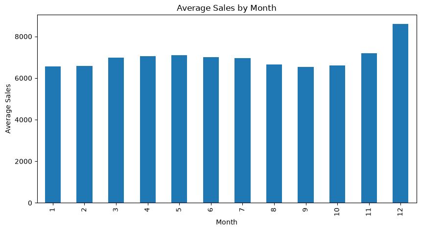
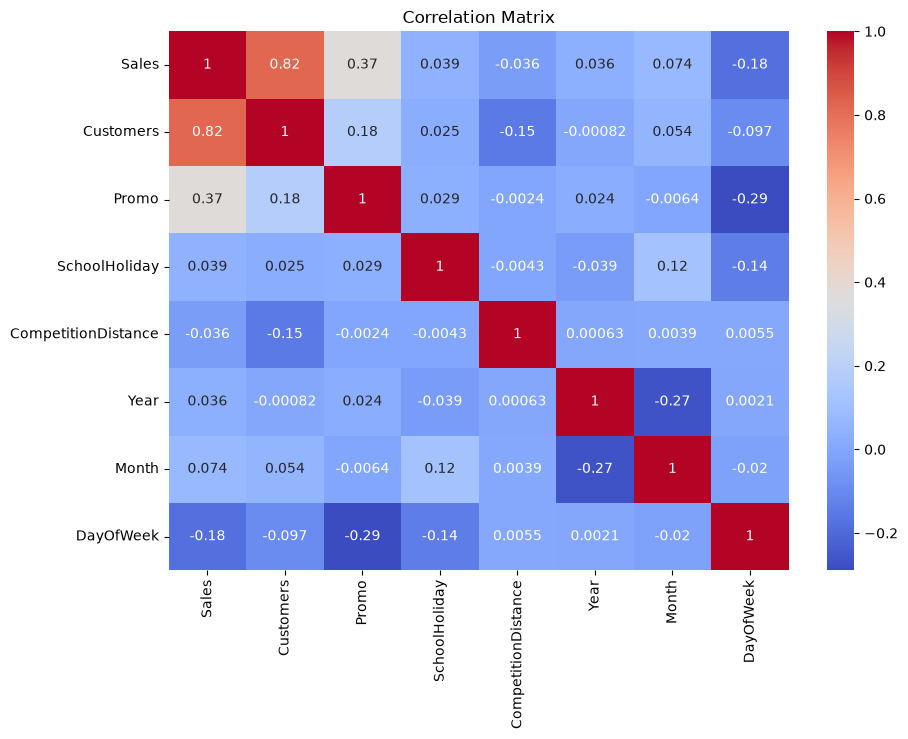
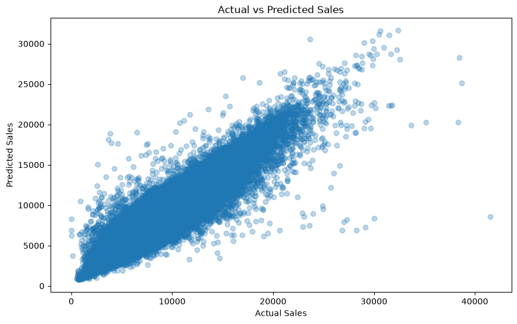
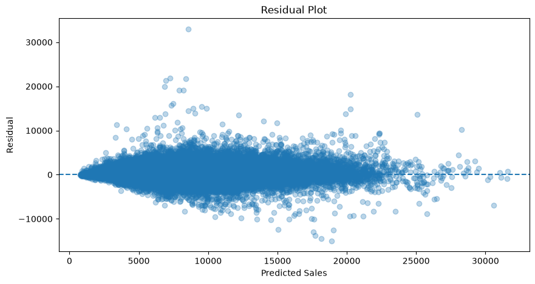
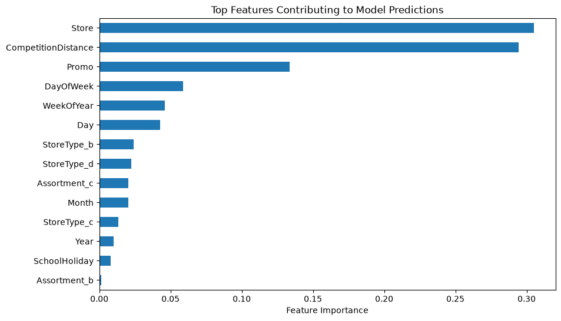

# Retail Sales & Demand Forecasting

## Business Problem

Retail businesses need to estimate future sales to support inventory
planning, promotional decisions, and operational planning.

## Objective

The objective of this project is to analyze historical retail sales data
and develop machine learning models to predict daily store sales.

## Approach

The project follows an end-to-end data science workflow:

1. Data understanding
2. Data cleaning
3. Exploratory data analysis
4. Feature engineering
5. SQL-based analysis
6. Machine learning
7. Model evaluation
8. Business interpretation

## Import Libraries


```python
import pandas as pd
import numpy as np

import matplotlib.pyplot as plt
import seaborn as sns

from sklearn.linear_model import LinearRegression
from sklearn.ensemble import RandomForestRegressor

from sklearn.metrics import (
    mean_absolute_error,
    mean_squared_error,
    r2_score
)

pd.set_option("display.max_columns", None)
```

## Load Data


```python
train = pd.read_csv("../data/train.csv")
store = pd.read_csv("../data/store.csv")
```

    C:\Users\dell\AppData\Local\Temp\ipykernel_26572\3419646863.py:1: DtypeWarning: Columns (7: StateHoliday) have mixed types. Specify dtype option on import or set low_memory=False.
      train = pd.read_csv("../data/train.csv")
    


```python
train.head()
```


<div>
<style scoped>
    .dataframe tbody tr th:only-of-type {
        vertical-align: middle;
    }

    .dataframe tbody tr th {
        vertical-align: top;
    }

    .dataframe thead th {
        text-align: right;
    }
</style>
<table border="1" class="dataframe">
  <thead>
    <tr style="text-align: right;">
      <th></th>
      <th>Store</th>
      <th>DayOfWeek</th>
      <th>Date</th>
      <th>Sales</th>
      <th>Customers</th>
      <th>Open</th>
      <th>Promo</th>
      <th>StateHoliday</th>
      <th>SchoolHoliday</th>
    </tr>
  </thead>
  <tbody>
    <tr>
      <th>0</th>
      <td>1</td>
      <td>5</td>
      <td>07/31/2015</td>
      <td>5263</td>
      <td>555</td>
      <td>1</td>
      <td>1</td>
      <td>0</td>
      <td>1</td>
    </tr>
    <tr>
      <th>1</th>
      <td>2</td>
      <td>5</td>
      <td>07/31/2015</td>
      <td>6064</td>
      <td>625</td>
      <td>1</td>
      <td>1</td>
      <td>0</td>
      <td>1</td>
    </tr>
    <tr>
      <th>2</th>
      <td>3</td>
      <td>5</td>
      <td>07/31/2015</td>
      <td>8314</td>
      <td>821</td>
      <td>1</td>
      <td>1</td>
      <td>0</td>
      <td>1</td>
    </tr>
    <tr>
      <th>3</th>
      <td>4</td>
      <td>5</td>
      <td>07/31/2015</td>
      <td>13995</td>
      <td>1498</td>
      <td>1</td>
      <td>1</td>
      <td>0</td>
      <td>1</td>
    </tr>
    <tr>
      <th>4</th>
      <td>5</td>
      <td>5</td>
      <td>07/31/2015</td>
      <td>4822</td>
      <td>559</td>
      <td>1</td>
      <td>1</td>
      <td>0</td>
      <td>1</td>
    </tr>
  </tbody>
</table>
</div>


```python
store.head()
```


<div>
<style scoped>
    .dataframe tbody tr th:only-of-type {
        vertical-align: middle;
    }

    .dataframe tbody tr th {
        vertical-align: top;
    }

    .dataframe thead th {
        text-align: right;
    }
</style>
<table border="1" class="dataframe">
  <thead>
    <tr style="text-align: right;">
      <th></th>
      <th>Store</th>
      <th>StoreType</th>
      <th>Assortment</th>
      <th>CompetitionDistance</th>
      <th>CompetitionOpenSinceMonth</th>
      <th>CompetitionOpenSinceYear</th>
      <th>Promo2</th>
      <th>Promo2SinceWeek</th>
      <th>Promo2SinceYear</th>
      <th>PromoInterval</th>
    </tr>
  </thead>
  <tbody>
    <tr>
      <th>0</th>
      <td>1</td>
      <td>c</td>
      <td>a</td>
      <td>1270.0</td>
      <td>9.0</td>
      <td>2008.0</td>
      <td>0</td>
      <td>NaN</td>
      <td>NaN</td>
      <td>NaN</td>
    </tr>
    <tr>
      <th>1</th>
      <td>2</td>
      <td>a</td>
      <td>a</td>
      <td>570.0</td>
      <td>11.0</td>
      <td>2007.0</td>
      <td>1</td>
      <td>13.0</td>
      <td>2010.0</td>
      <td>Jan,Apr,Jul,Oct</td>
    </tr>
    <tr>
      <th>2</th>
      <td>3</td>
      <td>a</td>
      <td>a</td>
      <td>14130.0</td>
      <td>12.0</td>
      <td>2006.0</td>
      <td>1</td>
      <td>14.0</td>
      <td>2011.0</td>
      <td>Jan,Apr,Jul,Oct</td>
    </tr>
    <tr>
      <th>3</th>
      <td>4</td>
      <td>c</td>
      <td>c</td>
      <td>620.0</td>
      <td>9.0</td>
      <td>2009.0</td>
      <td>0</td>
      <td>NaN</td>
      <td>NaN</td>
      <td>NaN</td>
    </tr>
    <tr>
      <th>4</th>
      <td>5</td>
      <td>a</td>
      <td>a</td>
      <td>29910.0</td>
      <td>4.0</td>
      <td>2015.0</td>
      <td>0</td>
      <td>NaN</td>
      <td>NaN</td>
      <td>NaN</td>
    </tr>
  </tbody>
</table>
</div>


```python
print("Train shape:", train.shape)
print("Store shape:", store.shape)
```

    Train shape: (1017209, 9)
    Store shape: (1115, 10)
    


```python
train.info()
```

    <class 'pandas.DataFrame'>
    RangeIndex: 1017209 entries, 0 to 1017208
    Data columns (total 9 columns):
     #   Column         Non-Null Count    Dtype 
    ---  ------         --------------    ----- 
     0   Store          1017209 non-null  int64 
     1   DayOfWeek      1017209 non-null  int64 
     2   Date           1017209 non-null  str   
     3   Sales          1017209 non-null  int64 
     4   Customers      1017209 non-null  int64 
     5   Open           1017209 non-null  int64 
     6   Promo          1017209 non-null  int64 
     7   StateHoliday   1017209 non-null  object
     8   SchoolHoliday  1017209 non-null  int64 
    dtypes: int64(7), object(1), str(1)
    memory usage: 69.8+ MB
    


```python
store.info()
```

    <class 'pandas.DataFrame'>
    RangeIndex: 1115 entries, 0 to 1114
    Data columns (total 10 columns):
     #   Column                     Non-Null Count  Dtype  
    ---  ------                     --------------  -----  
     0   Store                      1115 non-null   int64  
     1   StoreType                  1115 non-null   str    
     2   Assortment                 1115 non-null   str    
     3   CompetitionDistance        1112 non-null   float64
     4   CompetitionOpenSinceMonth  761 non-null    float64
     5   CompetitionOpenSinceYear   761 non-null    float64
     6   Promo2                     1115 non-null   int64  
     7   Promo2SinceWeek            571 non-null    float64
     8   Promo2SinceYear            571 non-null    float64
     9   PromoInterval              571 non-null    str    
    dtypes: float64(5), int64(2), str(3)
    memory usage: 87.2 KB
    

## Understand the Data


```python
train.describe()
```


<div>
<style scoped>
    .dataframe tbody tr th:only-of-type {
        vertical-align: middle;
    }

    .dataframe tbody tr th {
        vertical-align: top;
    }

    .dataframe thead th {
        text-align: right;
    }
</style>
<table border="1" class="dataframe">
  <thead>
    <tr style="text-align: right;">
      <th></th>
      <th>Store</th>
      <th>DayOfWeek</th>
      <th>Sales</th>
      <th>Customers</th>
      <th>Open</th>
      <th>Promo</th>
      <th>SchoolHoliday</th>
    </tr>
  </thead>
  <tbody>
    <tr>
      <th>count</th>
      <td>1.017209e+06</td>
      <td>1.017209e+06</td>
      <td>1.017209e+06</td>
      <td>1.017209e+06</td>
      <td>1.017209e+06</td>
      <td>1.017209e+06</td>
      <td>1.017209e+06</td>
    </tr>
    <tr>
      <th>mean</th>
      <td>5.584297e+02</td>
      <td>3.998341e+00</td>
      <td>5.773819e+03</td>
      <td>6.331459e+02</td>
      <td>8.301067e-01</td>
      <td>3.815145e-01</td>
      <td>1.786467e-01</td>
    </tr>
    <tr>
      <th>std</th>
      <td>3.219087e+02</td>
      <td>1.997391e+00</td>
      <td>3.849926e+03</td>
      <td>4.644117e+02</td>
      <td>3.755392e-01</td>
      <td>4.857586e-01</td>
      <td>3.830564e-01</td>
    </tr>
    <tr>
      <th>min</th>
      <td>1.000000e+00</td>
      <td>1.000000e+00</td>
      <td>0.000000e+00</td>
      <td>0.000000e+00</td>
      <td>0.000000e+00</td>
      <td>0.000000e+00</td>
      <td>0.000000e+00</td>
    </tr>
    <tr>
      <th>25%</th>
      <td>2.800000e+02</td>
      <td>2.000000e+00</td>
      <td>3.727000e+03</td>
      <td>4.050000e+02</td>
      <td>1.000000e+00</td>
      <td>0.000000e+00</td>
      <td>0.000000e+00</td>
    </tr>
    <tr>
      <th>50%</th>
      <td>5.580000e+02</td>
      <td>4.000000e+00</td>
      <td>5.744000e+03</td>
      <td>6.090000e+02</td>
      <td>1.000000e+00</td>
      <td>0.000000e+00</td>
      <td>0.000000e+00</td>
    </tr>
    <tr>
      <th>75%</th>
      <td>8.380000e+02</td>
      <td>6.000000e+00</td>
      <td>7.856000e+03</td>
      <td>8.370000e+02</td>
      <td>1.000000e+00</td>
      <td>1.000000e+00</td>
      <td>0.000000e+00</td>
    </tr>
    <tr>
      <th>max</th>
      <td>1.115000e+03</td>
      <td>7.000000e+00</td>
      <td>4.155100e+04</td>
      <td>7.388000e+03</td>
      <td>1.000000e+00</td>
      <td>1.000000e+00</td>
      <td>1.000000e+00</td>
    </tr>
  </tbody>
</table>
</div>


```python
train.isnull().sum()
```


    Store            0
    DayOfWeek        0
    Date             0
    Sales            0
    Customers        0
    Open             0
    Promo            0
    StateHoliday     0
    SchoolHoliday    0
    dtype: int64


```python
store.isnull().sum()
```


    Store                          0
    StoreType                      0
    Assortment                     0
    CompetitionDistance            3
    CompetitionOpenSinceMonth    354
    CompetitionOpenSinceYear     354
    Promo2                         0
    Promo2SinceWeek              544
    Promo2SinceYear              544
    PromoInterval                544
    dtype: int64


```python
train["Sales"].describe()
```


    count    1.017209e+06
    mean     5.773819e+03
    std      3.849926e+03
    min      0.000000e+00
    25%      3.727000e+03
    50%      5.744000e+03
    75%      7.856000e+03
    max      4.155100e+04
    Name: Sales, dtype: float64


```python
train.duplicated().sum()
```


    np.int64(0)


```python
store.duplicated().sum()
```


    np.int64(0)


## Merge the Datasets


```python
df = train.merge(
    store,
    on="Store",
    how="left"
)
```


```python
df.head()
```


<div>
<style scoped>
    .dataframe tbody tr th:only-of-type {
        vertical-align: middle;
    }

    .dataframe tbody tr th {
        vertical-align: top;
    }

    .dataframe thead th {
        text-align: right;
    }
</style>
<table border="1" class="dataframe">
  <thead>
    <tr style="text-align: right;">
      <th></th>
      <th>Store</th>
      <th>DayOfWeek</th>
      <th>Date</th>
      <th>Sales</th>
      <th>Customers</th>
      <th>Open</th>
      <th>Promo</th>
      <th>StateHoliday</th>
      <th>SchoolHoliday</th>
      <th>StoreType</th>
      <th>Assortment</th>
      <th>CompetitionDistance</th>
      <th>CompetitionOpenSinceMonth</th>
      <th>CompetitionOpenSinceYear</th>
      <th>Promo2</th>
      <th>Promo2SinceWeek</th>
      <th>Promo2SinceYear</th>
      <th>PromoInterval</th>
    </tr>
  </thead>
  <tbody>
    <tr>
      <th>0</th>
      <td>1</td>
      <td>5</td>
      <td>07/31/2015</td>
      <td>5263</td>
      <td>555</td>
      <td>1</td>
      <td>1</td>
      <td>0</td>
      <td>1</td>
      <td>c</td>
      <td>a</td>
      <td>1270.0</td>
      <td>9.0</td>
      <td>2008.0</td>
      <td>0</td>
      <td>NaN</td>
      <td>NaN</td>
      <td>NaN</td>
    </tr>
    <tr>
      <th>1</th>
      <td>2</td>
      <td>5</td>
      <td>07/31/2015</td>
      <td>6064</td>
      <td>625</td>
      <td>1</td>
      <td>1</td>
      <td>0</td>
      <td>1</td>
      <td>a</td>
      <td>a</td>
      <td>570.0</td>
      <td>11.0</td>
      <td>2007.0</td>
      <td>1</td>
      <td>13.0</td>
      <td>2010.0</td>
      <td>Jan,Apr,Jul,Oct</td>
    </tr>
    <tr>
      <th>2</th>
      <td>3</td>
      <td>5</td>
      <td>07/31/2015</td>
      <td>8314</td>
      <td>821</td>
      <td>1</td>
      <td>1</td>
      <td>0</td>
      <td>1</td>
      <td>a</td>
      <td>a</td>
      <td>14130.0</td>
      <td>12.0</td>
      <td>2006.0</td>
      <td>1</td>
      <td>14.0</td>
      <td>2011.0</td>
      <td>Jan,Apr,Jul,Oct</td>
    </tr>
    <tr>
      <th>3</th>
      <td>4</td>
      <td>5</td>
      <td>07/31/2015</td>
      <td>13995</td>
      <td>1498</td>
      <td>1</td>
      <td>1</td>
      <td>0</td>
      <td>1</td>
      <td>c</td>
      <td>c</td>
      <td>620.0</td>
      <td>9.0</td>
      <td>2009.0</td>
      <td>0</td>
      <td>NaN</td>
      <td>NaN</td>
      <td>NaN</td>
    </tr>
    <tr>
      <th>4</th>
      <td>5</td>
      <td>5</td>
      <td>07/31/2015</td>
      <td>4822</td>
      <td>559</td>
      <td>1</td>
      <td>1</td>
      <td>0</td>
      <td>1</td>
      <td>a</td>
      <td>a</td>
      <td>29910.0</td>
      <td>4.0</td>
      <td>2015.0</td>
      <td>0</td>
      <td>NaN</td>
      <td>NaN</td>
      <td>NaN</td>
    </tr>
  </tbody>
</table>
</div>


```python
df.shape
```


    (1017209, 18)


```python
df.info()
```

    <class 'pandas.DataFrame'>
    RangeIndex: 1017209 entries, 0 to 1017208
    Data columns (total 18 columns):
     #   Column                     Non-Null Count    Dtype  
    ---  ------                     --------------    -----  
     0   Store                      1017209 non-null  int64  
     1   DayOfWeek                  1017209 non-null  int64  
     2   Date                       1017209 non-null  str    
     3   Sales                      1017209 non-null  int64  
     4   Customers                  1017209 non-null  int64  
     5   Open                       1017209 non-null  int64  
     6   Promo                      1017209 non-null  int64  
     7   StateHoliday               1017209 non-null  object 
     8   SchoolHoliday              1017209 non-null  int64  
     9   StoreType                  1017209 non-null  str    
     10  Assortment                 1017209 non-null  str    
     11  CompetitionDistance        1014567 non-null  float64
     12  CompetitionOpenSinceMonth  693861 non-null   float64
     13  CompetitionOpenSinceYear   693861 non-null   float64
     14  Promo2                     1017209 non-null  int64  
     15  Promo2SinceWeek            509178 non-null   float64
     16  Promo2SinceYear            509178 non-null   float64
     17  PromoInterval              509178 non-null   str    
    dtypes: float64(5), int64(8), object(1), str(4)
    memory usage: 139.7+ MB
    


```python
df.isnull().sum()
```


    Store                             0
    DayOfWeek                         0
    Date                              0
    Sales                             0
    Customers                         0
    Open                              0
    Promo                             0
    StateHoliday                      0
    SchoolHoliday                     0
    StoreType                         0
    Assortment                        0
    CompetitionDistance            2642
    CompetitionOpenSinceMonth    323348
    CompetitionOpenSinceYear     323348
    Promo2                            0
    Promo2SinceWeek              508031
    Promo2SinceYear              508031
    PromoInterval                508031
    dtype: int64


## Handle Closed Stores

Closed stores have zero sales because they were not operating. The initial objective is to predict sales for operating stores, so keeping the analysis focused on open stores makes the target more meaningful.


```python
df["Open"].value_counts()
```


    Open
    1    844392
    0    172817
    Name: count, dtype: int64


```python
df = df[df["Open"] == 1].copy()
```


```python
df.shape
```


    (844392, 18)


```python
df["Sales"].describe()
```


    count    844392.000000
    mean       6955.514291
    std        3104.214680
    min           0.000000
    25%        4859.000000
    50%        6369.000000
    75%        8360.000000
    max       41551.000000
    Name: Sales, dtype: float64


## Date Processing


```python
df["Date"].dtype
```


    <StringDtype(storage='python', na_value=nan)>


```python
df["Date"] = pd.to_datetime(df["Date"])
```


```python
df["Year"] = df["Date"].dt.year
df["Month"] = df["Date"].dt.month
df["Day"] = df["Date"].dt.day
df["DayOfWeek"] = df["Date"].dt.dayofweek
df["WeekOfYear"] = df["Date"].dt.isocalendar().week.astype(int)
```


```python
df[
    [
        "Date",
        "Year",
        "Month",
        "Day",
        "DayOfWeek",
        "WeekOfYear"
    ]
].head()
```


<div>
<style scoped>
    .dataframe tbody tr th:only-of-type {
        vertical-align: middle;
    }

    .dataframe tbody tr th {
        vertical-align: top;
    }

    .dataframe thead th {
        text-align: right;
    }
</style>
<table border="1" class="dataframe">
  <thead>
    <tr style="text-align: right;">
      <th></th>
      <th>Date</th>
      <th>Year</th>
      <th>Month</th>
      <th>Day</th>
      <th>DayOfWeek</th>
      <th>WeekOfYear</th>
    </tr>
  </thead>
  <tbody>
    <tr>
      <th>0</th>
      <td>2015-07-31</td>
      <td>2015</td>
      <td>7</td>
      <td>31</td>
      <td>4</td>
      <td>31</td>
    </tr>
    <tr>
      <th>1</th>
      <td>2015-07-31</td>
      <td>2015</td>
      <td>7</td>
      <td>31</td>
      <td>4</td>
      <td>31</td>
    </tr>
    <tr>
      <th>2</th>
      <td>2015-07-31</td>
      <td>2015</td>
      <td>7</td>
      <td>31</td>
      <td>4</td>
      <td>31</td>
    </tr>
    <tr>
      <th>3</th>
      <td>2015-07-31</td>
      <td>2015</td>
      <td>7</td>
      <td>31</td>
      <td>4</td>
      <td>31</td>
    </tr>
    <tr>
      <th>4</th>
      <td>2015-07-31</td>
      <td>2015</td>
      <td>7</td>
      <td>31</td>
      <td>4</td>
      <td>31</td>
    </tr>
  </tbody>
</table>
</div>


## Exploratory Data Analysis

### Sales Distribution


```python
plt.figure(figsize=(10, 5))

sns.histplot(df["Sales"], bins=50)

plt.title("Distribution of Daily Sales")
plt.xlabel("Sales")
plt.ylabel("Frequency")

plt.savefig("../images/sales_distribution.png", bbox_inches='tight')
plt.show()
```


    

    


### Sales Over Time


```python
daily_sales = df.groupby("Date")["Sales"].sum()

plt.figure(figsize=(14, 5))
plt.plot(daily_sales)
plt.title("Total Daily Sales Over Time")
plt.xlabel("Date")
plt.ylabel("Total Sales")
plt.savefig("../images/sales_over_time.png", bbox_inches='tight')
plt.show()
```


    

    


### Sales by Day of Week


```python
day_sales = df.groupby("DayOfWeek")["Sales"].mean()

plt.figure(figsize=(8, 5))
day_sales.plot(kind="bar")
plt.title("Average Sales by Day of Week")
plt.xlabel("Day of Week")
plt.ylabel("Average Sales")
plt.savefig("../images/sales_by_day.png", bbox_inches='tight')
plt.show()
```


    

    


### Promotion vs Sales


```python
promo_sales = df.groupby("Promo")["Sales"].mean()
print(promo_sales)

plt.figure(figsize=(7, 5))
promo_sales.plot(kind="bar")
plt.title("Average Sales by Promotion Status")
plt.xlabel("Promotion")
plt.ylabel("Average Sales")
plt.savefig("../images/promotion_analysis.png", bbox_inches='tight')
plt.show()
```

    Promo
    0    5929.407603
    1    8228.281239
    Name: Sales, dtype: float64
    


    

    


### Sales by Store Type


```python
store_type_sales = df.groupby("StoreType")["Sales"].mean()
print(store_type_sales)

plt.figure(figsize=(8, 5))
store_type_sales.plot(kind="bar")
plt.title("Average Sales by Store Type")
plt.xlabel("Store Type")
plt.ylabel("Average Sales")
plt.show()
```

    StoreType
    a     6925.167661
    b    10231.407505
    c     6932.512755
    d     6822.141881
    Name: Sales, dtype: float64
    


    

    


### Monthly Sales


```python
monthly_sales = df.groupby("Month")["Sales"].mean()

plt.figure(figsize=(10, 5))
monthly_sales.plot(kind="bar")
plt.title("Average Sales by Month")
plt.xlabel("Month")
plt.ylabel("Average Sales")
plt.show()
```


    

    


### Correlation Analysis


```python
numeric_cols = [
    "Sales",
    "Customers",
    "Promo",
    "SchoolHoliday",
    "CompetitionDistance",
    "Year",
    "Month",
    "DayOfWeek"
]

plt.figure(figsize=(10, 7))
sns.heatmap(
    df[numeric_cols].corr(),
    annot=True,
    cmap="coolwarm"
)
plt.title("Correlation Matrix")
plt.show()
```


    

    


## Feature Selection


```python
features = [
    "Store",
    "DayOfWeek",
    "Promo",
    "SchoolHoliday",
    "StoreType",
    "Assortment",
    "CompetitionDistance",
    "Year",
    "Month",
    "Day",
    "WeekOfYear"
]

target = "Sales"
```

## Categorical Encoding


```python
df_model = pd.get_dummies(
    df[features + [target]],
    columns=["StoreType", "Assortment"],
    drop_first=True
)
df_model.head()
```


<div>
<style scoped>
    .dataframe tbody tr th:only-of-type {
        vertical-align: middle;
    }

    .dataframe tbody tr th {
        vertical-align: top;
    }

    .dataframe thead th {
        text-align: right;
    }
</style>
<table border="1" class="dataframe">
  <thead>
    <tr style="text-align: right;">
      <th></th>
      <th>Store</th>
      <th>DayOfWeek</th>
      <th>Promo</th>
      <th>SchoolHoliday</th>
      <th>CompetitionDistance</th>
      <th>Year</th>
      <th>Month</th>
      <th>Day</th>
      <th>WeekOfYear</th>
      <th>Sales</th>
      <th>StoreType_b</th>
      <th>StoreType_c</th>
      <th>StoreType_d</th>
      <th>Assortment_b</th>
      <th>Assortment_c</th>
    </tr>
  </thead>
  <tbody>
    <tr>
      <th>0</th>
      <td>1</td>
      <td>4</td>
      <td>1</td>
      <td>1</td>
      <td>1270.0</td>
      <td>2015</td>
      <td>7</td>
      <td>31</td>
      <td>31</td>
      <td>5263</td>
      <td>False</td>
      <td>True</td>
      <td>False</td>
      <td>False</td>
      <td>False</td>
    </tr>
    <tr>
      <th>1</th>
      <td>2</td>
      <td>4</td>
      <td>1</td>
      <td>1</td>
      <td>570.0</td>
      <td>2015</td>
      <td>7</td>
      <td>31</td>
      <td>31</td>
      <td>6064</td>
      <td>False</td>
      <td>False</td>
      <td>False</td>
      <td>False</td>
      <td>False</td>
    </tr>
    <tr>
      <th>2</th>
      <td>3</td>
      <td>4</td>
      <td>1</td>
      <td>1</td>
      <td>14130.0</td>
      <td>2015</td>
      <td>7</td>
      <td>31</td>
      <td>31</td>
      <td>8314</td>
      <td>False</td>
      <td>False</td>
      <td>False</td>
      <td>False</td>
      <td>False</td>
    </tr>
    <tr>
      <th>3</th>
      <td>4</td>
      <td>4</td>
      <td>1</td>
      <td>1</td>
      <td>620.0</td>
      <td>2015</td>
      <td>7</td>
      <td>31</td>
      <td>31</td>
      <td>13995</td>
      <td>False</td>
      <td>True</td>
      <td>False</td>
      <td>False</td>
      <td>True</td>
    </tr>
    <tr>
      <th>4</th>
      <td>5</td>
      <td>4</td>
      <td>1</td>
      <td>1</td>
      <td>29910.0</td>
      <td>2015</td>
      <td>7</td>
      <td>31</td>
      <td>31</td>
      <td>4822</td>
      <td>False</td>
      <td>False</td>
      <td>False</td>
      <td>False</td>
      <td>False</td>
    </tr>
  </tbody>
</table>
</div>


## Missing Values


```python
df_model.isnull().sum()
```


    Store                     0
    DayOfWeek                 0
    Promo                     0
    SchoolHoliday             0
    CompetitionDistance    2186
    Year                      0
    Month                     0
    Day                       0
    WeekOfYear                0
    Sales                     0
    StoreType_b               0
    StoreType_c               0
    StoreType_d               0
    Assortment_b              0
    Assortment_c              0
    dtype: int64


```python
df_model = df_model.dropna()
```

## Chronological Train/Test Split


```python
df_model = df_model.sort_values(
    by=["Year", "Month", "Day"]
)

X = df_model.drop(columns=["Sales"])
y = df_model["Sales"]

split_index = int(len(df_model) * 0.8)

X_train = X.iloc[:split_index]
X_test = X.iloc[split_index:]

y_train = y.iloc[:split_index]
y_test = y.iloc[split_index:]
```

## Linear Regression Baseline


```python
linear_model = LinearRegression()
linear_model.fit(X_train, y_train)

y_pred_linear = linear_model.predict(X_test)
```

## Linear Regression Evaluation


```python
mae_linear = mean_absolute_error(y_test, y_pred_linear)
rmse_linear = np.sqrt(mean_squared_error(y_test, y_pred_linear))
r2_linear = r2_score(y_test, y_pred_linear)

print("Linear Regression MAE:", mae_linear)
print("Linear Regression RMSE:", rmse_linear)
print("Linear Regression R²:", r2_linear)
```

    Linear Regression MAE: 1985.7183875824687
    Linear Regression RMSE: 2737.5181552495046
    Linear Regression R²: 0.2015281079963115
    

## Random Forest Regressor


```python
rf_model = RandomForestRegressor(
    n_estimators=100,
    random_state=42,
    n_jobs=-1
)
rf_model.fit(X_train, y_train)

y_pred_rf = rf_model.predict(X_test)
```

## Random Forest Evaluation


```python
mae_rf = mean_absolute_error(y_test, y_pred_rf)
rmse_rf = np.sqrt(mean_squared_error(y_test, y_pred_rf))
r2_rf = r2_score(y_test, y_pred_rf)

print("Random Forest MAE:", mae_rf)
print("Random Forest RMSE:", rmse_rf)
print("Random Forest R²:", r2_rf)
```

    Random Forest MAE: 738.0147077925933
    Random Forest RMSE: 1098.7271370908447
    Random Forest R²: 0.8713750204618992
    

## Model Comparison


```python
results = pd.DataFrame({
    "Model": ["Linear Regression", "Random Forest"],
    "MAE": [mae_linear, mae_rf],
    "RMSE": [rmse_linear, rmse_rf],
    "R2": [r2_linear, r2_rf]
})
results
```


<div>
<style scoped>
    .dataframe tbody tr th:only-of-type {
        vertical-align: middle;
    }

    .dataframe tbody tr th {
        vertical-align: top;
    }

    .dataframe thead th {
        text-align: right;
    }
</style>
<table border="1" class="dataframe">
  <thead>
    <tr style="text-align: right;">
      <th></th>
      <th>Model</th>
      <th>MAE</th>
      <th>RMSE</th>
      <th>R2</th>
    </tr>
  </thead>
  <tbody>
    <tr>
      <th>0</th>
      <td>Linear Regression</td>
      <td>1985.718388</td>
      <td>2737.518155</td>
      <td>0.201528</td>
    </tr>
    <tr>
      <th>1</th>
      <td>Random Forest</td>
      <td>738.014708</td>
      <td>1098.727137</td>
      <td>0.871375</td>
    </tr>
  </tbody>
</table>
</div>


## Actual vs Predicted


```python
plt.figure(figsize=(10, 6))
plt.scatter(y_test, y_pred_rf, alpha=0.3)
plt.xlabel("Actual Sales")
plt.ylabel("Predicted Sales")
plt.title("Actual vs Predicted Sales")
plt.savefig("../images/actual_vs_predicted.png", bbox_inches='tight')
plt.show()
```


    

    


## Residual Analysis


```python
residuals = y_test - y_pred_rf

plt.figure(figsize=(10, 5))
plt.scatter(y_pred_rf, residuals, alpha=0.3)
plt.axhline(0, linestyle="--")
plt.xlabel("Predicted Sales")
plt.ylabel("Residual")
plt.title("Residual Plot")
plt.show()
```


    

    


## Feature Importance


```python
importance = pd.Series(rf_model.feature_importances_, index=X_train.columns)
importance = importance.sort_values(ascending=False)
importance.head(15)

plt.figure(figsize=(10, 6))
importance.head(15).sort_values().plot(kind="barh")
plt.title("Top Features Contributing to Model Predictions")
plt.xlabel("Feature Importance")
plt.show()
```


    

    


## Business Insights

1. Sales showed observable variation across time periods, suggesting temporal patterns relevant to demand planning.
2. Promotional and non-promotional periods showed different average observed sales levels.
3. Sales behavior varied across store types, indicating that store-level characteristics may be useful predictive variables.
4. The Random Forest model identified several features that contributed strongly to its predictions.
5. The forecasting approach could potentially support inventory and operational planning by providing estimated future sales.

## Limitations

- The dataset represents historical sales and may not fully represent future market conditions.
- External variables such as weather, local economic conditions, competitor actions, and unexpected events are not fully captured.
- The model predicts sales but does not establish causal relationships.
- Additional lag and rolling-window features could potentially improve the forecasting approach.
- Model performance may vary across individual stores and time periods.

## Future Improvements

- Add lag-based sales features
- Add rolling averages
- Experiment with gradient boosting models
- Perform hyperparameter tuning
- Incorporate additional external variables
- Evaluate models using rolling/expanding time-series validation
- Develop a formal time-series forecasting approach
- Deploy the model through an API
- Build an interactive dashboard
